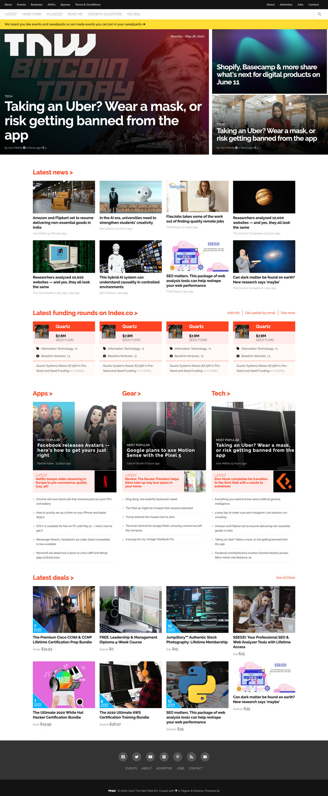
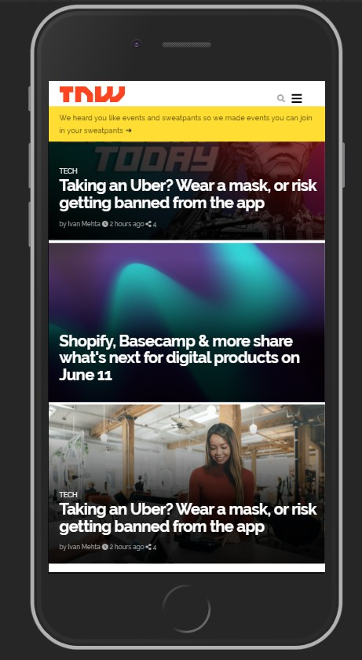

# The Next Web Webpage Clone

The goal of this project is to build a responsive clone of [The Next Web website](https://thenextweb.com/)

> In this project, we made use of Grids, Flexbox and Positions and layout elements on the page correctly.

> Media queries were used to target "different” screen sizes in order for us to effectively and efficiently let the website fit correctly to each screen size.

> Building this project was fun as we practiced different css rules and effectively combine grids, flex and position.




This project covers the following HTML and CSS3 concepts

- Fixed, relative and absolute positioning
- Flex and Grid
- Responsive Design concepts using media queries

## Built With

- HTML
- CSS
- Google fonts
- Font Awesome

## Live Demo

[Live Demo Link](https://raw.githack.com/vmwhoami/The-Next-Web/feature-home/index.html)

## Getting Started

To get a local copy of the repository, please run the following commands on your terminal:

```
$ cd <folder>
```

```
$ git clone https://github.com/vmwhoami/The-Next-Web

```

## Authors

**Uduak Essien**

- Github: [@acushlakoncept](https://github.com/acushlakoncept/)
- Twitter: [@acushlakoncept](https://twitter.com/acushlakoncept)
- Linkedin: [acushlakoncept](https://www.linkedin.com/in/acushlakoncept/)

**Vitalie Melnic**

- Github: [github](https://github.com/vmwhoami)
- Twitter: [LinkedIn](https://www.linkedin.com/in/vitalie-melnic-5802198a/)
- Linkedin: [twitter](https://twitter.com/vmwhoami)

## 🤝 Contributing

Contributions issues and feature requests are welcome!

Check the [issues page](https://github.com/vmwhoami/The-Next-Web/issues).

## Show your support

Give a ⭐️ if you like this project!

## Acknowledgments

- Project originally taken from The Odin Project
- Project inspired by Microverse Program
